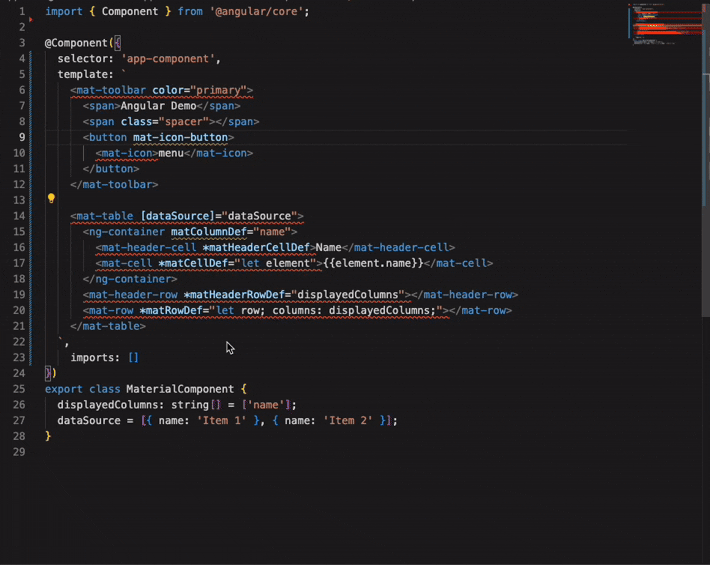

# Angular Auto-Import for VS Code

Streamline your Angular development with intelligent, automatic imports for components, directives, and pipes directly in your HTML templates and TypeScript files.

 

## Features

- **⚡️ Automatic Imports**: Get quick fix suggestions to import Angular elements that are not yet included in your component's module.
- **💡 Smart Completions**: Autocomplete for component tags, directives, and pipes in HTML templates (`.html`) and inline templates within TypeScript files.
- **🔍 Diagnostics**: Identifies unknown Angular elements in your templates and provides quick fixes.
- **Monorepo Support**: Works seamlessly with multi-project workspaces, like Nx.
- **Path Alias Resolution**: Understands `tsconfig.json` path aliases (`@app/*`, `@shared/*`, etc.) for correct import path generation.
- **Standalone Component Support**: Works with both module-based and standalone Angular components, directives, and pipes.

## Installation

Install "Angular Auto Import" from the Visual Studio Code Marketplace:

[Install Extension](https://marketplace.visualstudio.com/items?itemName=baryshevrs.angular-auto-import)

Alternatively, search for `Angular Auto Import` in the VS Code Extensions view (`Ctrl+Shift+X` or `Cmd+Shift+X`).

## Usage

### Automatic Quick Fixes

When you use an Angular component, directive, or pipe in your template that hasn't been imported into the corresponding NgModule or component's `imports` array, the extension will display a squiggly line (based on your configured diagnostics severity).

1.  **Hover over the unknown element** (tag, attribute, or pipe).
2.  **Click the lightbulb icon** or press `Ctrl+.` (`Cmd+.` on macOS) to see available Quick Fixes.
3.  **Select the import suggestion** (e.g., `Import MyComponent from './my.component'`).

The extension will automatically add the necessary import statement to your TypeScript file and include the component/directive/pipe in your `@NgModule`'s `imports` array or your standalone component's `imports` array.

### Smart Completions

Start typing an Angular element selector (e.g., `<my-component`, `[myDirective]`, `| myPipe`) in your HTML or inline TypeScript template. The extension will provide completion suggestions.

### Manual Import Command

If you prefer to manually import an element by its selector or pipe name:

1.  Open the Command Palette (`Ctrl+Shift+P` or `Cmd+Shift+P`).
2.  Search for `Angular Auto Import: Manually Import Element by Selector`.
3.  Enter the selector (e.g., `my-component`, `testDirective`, `myPipe`).

## Configuration

You can customize the extension's behavior via VS Code settings (`settings.json`):

| Setting                                     | Description                                                                                                   | Default   |
| ------------------------------------------- | ------------------------------------------------------------------------------------------------------------- | --------- |
| `angular-auto-import.projectPath`           | Optional. Absolute path to the Angular project root. If not set, uses open workspace folders.                 | `null`    |
| `angular-auto-import.index.refreshInterval` | Interval in minutes for automatically reindexing Angular elements. Set to `0` to disable periodic reindexing. | `60`      |
| `angular-auto-import.diagnostics.enabled`   | Enable or disable diagnostics for missing imports.                                                            | `true`    |
| `angular-auto-import.diagnostics.severity`  | The severity of diagnostics for missing imports (`error`, `warning`, `info`).                                 | `warning` |

## Troubleshooting

- **Elements not found**: If elements are not being auto-imported, try running the `Angular Auto Import: Reindex Project(s)` command.
- **Performance issues**: For very large projects, consider increasing `angular-auto-import.index.refreshInterval` or setting `angular-auto-import.projectPath` to a specific sub-project root.
- **Incorrect imports**: Ensure your `tsconfig.json` `baseUrl` and `paths` are correctly configured.
 
---

## Limitations

> While Angular Auto Import aims to simplify your development experience, there are a few current limitations you should be aware of:

1. **File Naming Convention**
   The extension only detects and indexes Angular components, directives, and pipes whose filenames include a specific suffix:

    * Components: filenames must include `.component.ts`
    * Directives: filenames must include `.directive.ts`
    * Pipes: filenames must include `.pipe.ts`
      Files that do not follow this naming convention will be ignored during indexing and auto-import suggestions.

2. **Standalone-Only Project Support**
   The extension currently supports:

    * **Standalone components, directives, and pipes** only.
    * **Built-in Angular modules, directives, and pipes** like `NgIf`, `NgFor`, and `DatePipe` are supported as well.

   Traditional Angular modules (`@NgModule`) containing declared components are not yet supported. Projects mixing standalone and module-based declarations may experience incomplete import suggestions.

--- 

## License

[MIT License](LICENSE).
