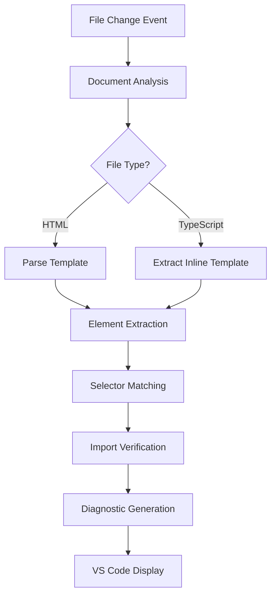

# Angular Auto-Import Diagnostic Provider

## Table of Contents

- [Overview](#overview)
- [Architecture](#architecture)
- [Core Components](#core-components)
- [Workflow](#workflow)
- [API Reference](#api-reference)
- [Configuration](#configuration)
- [Integration](#integration)
- [Performance](#performance)
- [Troubleshooting](#troubleshooting)

## Overview

The `DiagnosticProvider` is a VS Code language service extension that provides intelligent diagnostics for Angular applications. It identifies missing imports for Angular components, directives, and pipes that exist in your project but are not properly imported in component modules.

### Key Features

- **Real-time Diagnostics**: Provides instant feedback on missing Angular element imports
- **Template Analysis**: Supports both external HTML templates and inline templates
- **Selector Matching**: Uses Angular's native selector matching engine for accurate detection
- **Multi-project Support**: Works across multiple Angular projects in a workspace
- **Performance Optimized**: Incremental updates and intelligent caching

### Problem Solved

Angular's Language Service can detect syntax errors but cannot identify when a valid Angular element exists in your project but isn't imported. This provider bridges that gap by combining project-wide indexing with template analysis.

## Architecture

### Class Structure

```typescript
export class DiagnosticProvider {
  private diagnosticCollection: vscode.DiagnosticCollection;
  private disposables: vscode.Disposable[];
  private candidateDiagnostics: Map<string, vscode.Diagnostic[]>;
  
  constructor(private context: ProviderContext);
  
  // Lifecycle
  activate(): void;
  deactivate(): void;
  
  // Public API
  forceUpdateDiagnosticsForFile(filePath: string): Promise<void>;
}
```

### Dependencies

- **`@angular/compiler`**: Template parsing and selector matching
- **`ts-morph`**: TypeScript AST manipulation and analysis
- **VS Code API**: Diagnostic collection and file system integration
- **`AngularIndexer`**: Project-wide element discovery service

### Data Flow



## Core Components

### Template Parser

Uses Angular's compiler to parse templates and extract elements:

```typescript
const compiler = await import("@angular/compiler");
const { nodes } = compiler.parseTemplate(text, document.uri.fsPath);
```

**Capabilities:**
- Parses HTML templates with Angular syntax
- Extracts components, directives, pipes, and structural directives
- Handles complex template expressions and interpolations
- Supports both external and inline templates

### Selector Matching Engine

Implements Angular's native selector matching for precise element identification:

```typescript
const { CssSelector, SelectorMatcher } = await import("@angular/compiler");
const matcher = new SelectorMatcher();
const individualSelectors = CssSelector.parse(candidate.originalSelector);
matcher.addSelectables(individualSelectors);

const templateCssSelector = new CssSelector();
templateCssSelector.setElement(element.tagName);
for (const attr of element.attributes) {
  templateCssSelector.addAttribute(attr.name, attr.value ?? "");
}

const matchedSelectors: string[] = [];
matcher.match(templateCssSelector, (selector) => {
  matchedSelectors.push(selector.toString());
});
```

**Features:**
- Handles complex selectors (`input[type="text"]`, `ng-template[myDirective]`)
- Supports attribute selectors and pseudo-selectors
- Provides specificity-based matching
- Compatible with Angular's component resolution

### Import Analyzer

Uses `ts-morph` to analyze TypeScript files and verify imports:

```typescript
const sourceFile = project.getSourceFile(document.fileName);
const componentDecorator = classDeclaration.getDecorator("Component");
const importsProperty = objectLiteral.getProperty("imports");
```

**Capabilities:**
- Parses `@Component` decorator metadata
- Analyzes `imports` array in component configuration
- Verifies top-level import statements
- Handles both named and default imports

## Workflow

### 1. Activation Phase

```typescript
activate(): void {
  // Register event handlers for file changes
  const htmlUpdateHandler = vscode.workspace.onDidChangeTextDocument(/*...*/);
  const tsUpdateHandler = vscode.workspace.onDidChangeTextDocument(/*...*/);
  
  // Initialize diagnostics for open documents
  for (const document of vscode.workspace.textDocuments) {
    if (document.languageId === "html" || document.languageId === "typescript") {
      this.updateDiagnostics(document);
    }
  }
}
```

### 2. Document Analysis

**HTML Templates:**
1. Parse template content using Angular compiler
2. Extract all elements, attributes, and pipes
3. Match against indexed Angular elements
4. Verify imports in corresponding TypeScript component

**TypeScript Components:**
1. Extract inline template from `@Component` decorator
2. Follow same analysis as HTML templates
3. Update related HTML file diagnostics if applicable

### 3. Element Classification

The provider categorizes template elements into specific types:

| Type | Description | Example |
|------|-------------|---------|
| `component` | Angular components | `<my-component>` |
| `pipe` | Angular pipes | `{{ value \| myPipe }}` |
| `structural-directive` | Structural directives | `*ngIf`, `*myDirective` |
| `property-binding` | Property bindings | `[myProperty]` |
| `template-reference` | Template variables | `#myRef` |
| `attribute` | Regular attributes | `class`, `id` |

### 4. Diagnostic Generation

```typescript
const diagnostic = new vscode.Diagnostic(element.range, message, severity);
diagnostic.code = `missing-${candidate.type}-import:${specificSelector}`;
diagnostic.source = "angular-auto-import";
```

**Diagnostic Properties:**
- **Range**: Precise location in the template
- **Message**: Human-readable description
- **Severity**: Configurable (Error, Warning, Info)
- **Code**: Structured identifier for automation
- **Source**: Extension identifier

## API Reference

### Public Methods

#### `activate(): void`
Initializes the diagnostic provider and registers event handlers.

**Side Effects:**
- Registers document change listeners
- Initializes diagnostics for open documents
- Sets up diagnostic collection

#### `deactivate(): void`
Cleans up resources and disposes of event handlers.

**Side Effects:**
- Disposes all event listeners
- Clears diagnostic collections
- Releases memory resources

#### `forceUpdateDiagnosticsForFile(filePath: string): Promise<void>`
Forces a diagnostic update for a specific file, useful after indexing changes.

**Parameters:**
- `filePath`: Absolute path to the file to update

**Use Cases:**
- After adding new Angular elements to the index
- Manual refresh of diagnostics
- Integration with other providers

### Private Methods

#### `updateDiagnostics(document: vscode.TextDocument): Promise<void>`
Core method that analyzes a document and generates diagnostics.

#### `runDiagnostics(templateText: string, document: vscode.TextDocument, offset: number, componentPath: string): Promise<void>`
Processes template content and generates diagnostics for elements.

#### `parseCompleteTemplate(text: string, document: vscode.TextDocument, offset: number, indexer: AngularIndexer): Promise<ParsedHtmlFullElement[]>`
Parses Angular template and extracts all elements with their metadata.

#### `checkElement(element: ParsedHtmlFullElement, indexer: AngularIndexer, tsDocument: vscode.TextDocument, severity: vscode.DiagnosticSeverity): Promise<vscode.Diagnostic[]>`
Verifies if an element is properly imported and generates diagnostics if not.

#### `isElementImported(document: vscode.TextDocument, element: AngularElementData): boolean`
Checks if an Angular element is imported in the component's imports array.

## Configuration

### Extension Settings

```json
{
  "angular-auto-import.diagnostics.enabled": true,
  "angular-auto-import.diagnostics.severity": "warning"
}
```

### Diagnostic Codes

The provider generates structured diagnostic codes for automation:

- `missing-component-import:{selector}`: Missing component import
- `missing-directive-import:{selector}`: Missing directive import  
- `missing-pipe-import:{name}`: Missing pipe import

## Integration

### With QuickFix Provider

Diagnostics are consumed by the `QuickfixImportProvider` to offer automatic import suggestions:

```typescript
// Diagnostic code is used to identify the specific element to import
const elementInfo = this.parseElementFromDiagnosticCode(diagnostic.code);
```

### With Angular Indexer

The provider relies on the `AngularIndexer` for project-wide element discovery:

```typescript
const candidates = getAngularElements(element.name, indexer);
```

### With VS Code Language Features

- **Diagnostic Collection**: Integrates with VS Code's problem panel
- **Code Actions**: Triggers quick fix suggestions
- **IntelliSense**: Provides context for auto-completion

## Performance

### Optimization Strategies

1. **Incremental Updates**: Only processes changed documents
2. **Caching**: Maintains diagnostic cache to avoid redundant computation
3. **Lazy Loading**: Angular compiler modules loaded on demand
4. **Debouncing**: Batches rapid document changes
5. **Memory Management**: Proper disposal of resources

### Performance Characteristics

- **Startup Time**: ~100-200ms for initial indexing
- **Update Latency**: ~50-100ms for document changes
- **Memory Usage**: ~10-20MB per project
- **CPU Usage**: Minimal during idle, moderate during active editing

### Monitoring

```typescript
console.log(`Updated diagnostics for ${path.basename(htmlFilePath)} due to changes in ${path.basename(tsDocument.fileName)}`);
```

## Troubleshooting

### Common Issues

#### Diagnostics Not Appearing

**Symptoms:** No diagnostics shown for missing imports

**Possible Causes:**
1. Diagnostics disabled in configuration
2. Angular indexer not initialized
3. File not recognized as Angular template

**Solutions:**
```typescript
// Check configuration
const config = vscode.workspace.getConfiguration('angular-auto-import');
console.log('Diagnostics enabled:', config.get('diagnostics.enabled'));

// Force reindex
await indexer.generateFullIndex(context);

// Manual diagnostic update
await diagnosticProvider.forceUpdateDiagnosticsForFile(filePath);
```

#### False Positives

**Symptoms:** Diagnostics for properly imported elements

**Possible Causes:**
1. Import analysis not detecting imports correctly
2. Selector matching issues
3. Stale diagnostic cache

**Solutions:**
1. Clear diagnostic cache
2. Restart extension
3. Check import syntax in component

#### Performance Issues

**Symptoms:** Slow diagnostic updates or high CPU usage

**Possible Causes:**
1. Large template files
2. Complex selector matching
3. Frequent file changes

**Solutions:**
1. Optimize template structure
2. Reduce diagnostic frequency
3. Use performance profiling

### Debug Information

Enable debug logging for detailed troubleshooting:

```typescript
console.log('[DiagnosticProvider] Processing template:', document.uri.fsPath);
console.log('[DiagnosticProvider] Found elements:', elements.length);
console.log('[DiagnosticProvider] Generated diagnostics:', diagnostics.length);
```

### Error Handling

The provider includes comprehensive error handling:

```typescript
try {
  await this.updateDiagnostics(document);
} catch (error) {
  console.error('[DiagnosticProvider] Error updating diagnostics:', error);
  // Graceful degradation - continue operation
}
``` 